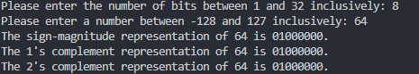

# Lab1

## Group Members
- Peemmaphat Sripongsai 67070503436
- Suwiwat Sinsomboon 67070503437

## Githun source code
[https://github.com/iceswift/cpe223_com-arch_labs/blob/main/Lab1/Lab1_PS1-%20number%20representations.c](https://github.com/iceswift/cpe223_com-arch_labs/blob/main/Lab1/Lab1_PS1-%20number%20representations.c)

## Variables
It store variables like `(eg. minVal, maxVal)` in long long because it can store up to 64 bits if we use normal int and user input 32 bits the program would be not work.

## Helper Functions
**powerOfTwo**
- **What it does**
Calculates the value of 2 raised to the power of n (e.g., $2^3 = 8$).

- **How it works**
It starts with `1` and uses a simple loop to multiply the result by 2 repeatedly `n` times. It returns a `long long` (64-bit) integer to ensure the calculation does not crash (overflow) when handling large numbers like $2^{31}$.

**printBinary** 
- **What it does**
Prints the binary sequence (0s and 1s) of a number for a specified length.

- **How it works**
It loops from the leftmost bit (Highest Index) down to 0. In every step, it creates a "scanner" mask by shifting `1` to the current position (`1LL << i`). It compares this mask with the input number; if they overlap (match), it prints "1", otherwise it prints "0".

## Range Calculation
First it receive number of bits between 1-32 bits as input. It Reads the user's input as a raw text string instead of a number. This preserves the characters exactly as typed (e.g., "-0") then we convert to `long long` with `atoll`

Then checks the raw text. If the user explicitly typed "-0", we set a flag variable `(isNegZero = 1)`

then it check edge case whether input withing range or not 

**if not:** return and print out error 
**if yes:** process to next step.

then it calculate the minimum and maximum number range of that bit by using formula below and store in `minVal` and `maxVal` variables
- Minimum: $-2^{N-1}$.
- Maximum: $2^{N-1} - 1$.

After range calculation it then ask user to input number between that range. It then check edge wether input number within range 

**if not:** return and print out error 
**if yes:** process to next step.

## Sign magnitude
1. Check if input number is between `-maxVal` and `maxVal`  because Sign-Magnitude has a smaller range than 2's complement because it wastes a binary pattern on "-0" that's why we check minimum with `-maxVal`.
 
2. Check the input's sign. Manually print 1 for negative or 0 for positive.
 
3. Convert the input to its absolute value (llabs) and pass it to the `printBinary` function. Limit the printer to `bits - 1` length, as the first bit is already used.

## 1st complement
1. Check if input number is between `-maxVal` and `maxVal`. Like Sign-Magnitude, 1's complement has a smaller range because it also wastes a binary pattern on "-0" (all ones).
 
2. If the input is **positive**, pass it directly to `printBinary` using the full bit length. 
  
3. If the input is **negative**, calculate the inverse using the formula `(2^N - 1) - |input|`. This mathematically flips all the bits (0s become 1s, 1s become 0s) without needing a loop, then print the result.

## 2nd complement
1. Check if input number is between `minVal` and `maxVal`. Also, check if the input is explicitly "-0". Since 2's complement only has one "0" (positive), it cannot represent a distinct negative zero.
  
2. If the input is positive, pass it directly to `printBinary` using the full bit length. 
  
3. If the input is **negative**, calculate the value using the modular offset formula `2^N + input`. This finds the correct binary pattern by "rolling over" the maximum capacity (e.g., -1 becomes the maximum binary value), then print the result.

## Test cases

### Test Case #1
#### Input
| Number of bits | Input decimal | Sign and magnitude | 1’s complement | 2’s complement |
| :---: | :---: | :---: | :---: | :---: |
| 3 | -4 | Can’t be represented | Can’t be represented | 100 |

#### Output

### Test Case #2
#### Input
| Number of bits | Input decimal | Sign and magnitude | 1’s complement | 2’s complement |
| :---: | :---: | :---: | :---: | :---: |
| 4 | -7 | 1111 | 1000 | 1001 |

#### Output

### Test Case #3
#### Input
| Number of bits | Input decimal | Sign and magnitude | 1’s complement | 2’s complement |
| :---: | :---: | :---: | :---: | :---: |
| 3 | 2 | 010 | 010 | 010 |

#### Output

### Test Case #4
#### Input
| Number of bits | Input decimal | Sign and magnitude | 1’s complement | 2’s complement |
| :---: | :---: | :---: | :---: | :---: |
| 4 | 0 | 0000 | 0000 | 0000 |

#### Output

### Test Case #5
#### Input
| Number of bits | Input decimal | Sign and magnitude | 1’s complement | 2’s complement |
| :---: | :---: | :---: | :---: | :---: |
| 4 | -0 | 1000 | 1111 | Can’t be represented |

#### Output

### Test Case #6
#### Input
| Number of bits | Input decimal | Sign and magnitude | 1’s complement | 2’s complement |
| :---: | :---: | :---: | :---: | :---: |
| 8 | 64 | 01000000 | 01000000 | 01000000 |

#### Output

### Test Case #7
#### Input
| Number of bits | Input decimal | Sign and magnitude | 1’s complement | 2’s complement |
| :---: | :---: | :---: | :---: | :---: |
| 3 | 3 | 011 | 011 | 011 |

#### Output
